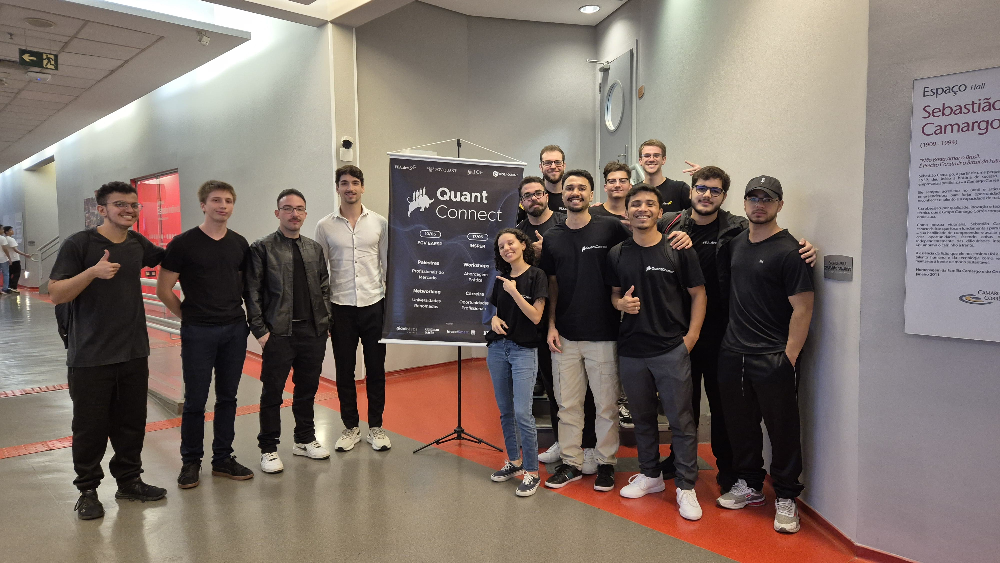
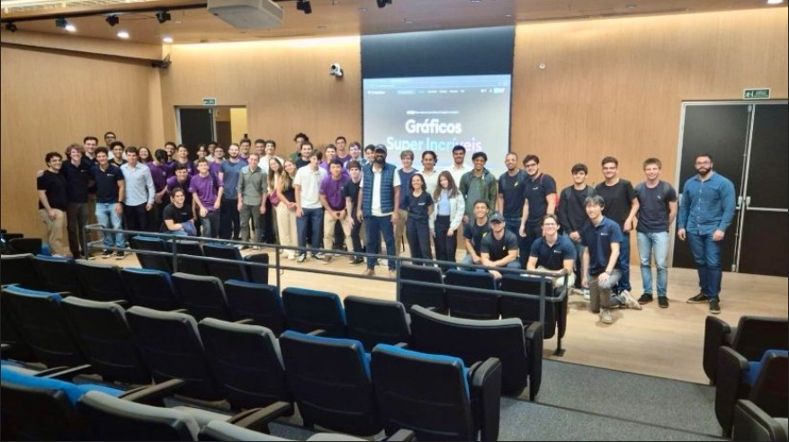
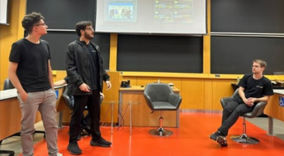
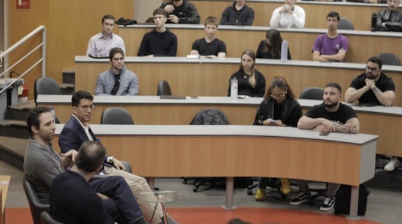

# Bem-vindo!

> [!info] O que é o Hub?
> É uma iniciativa de **acervo público** de materiais técnicos, produzidos internamente na entidade — artigos, tutoriais e projetos autorais.  
> Produzido pelos membros da FEA.dev, com o objetivo de divulgar parte do nosso trabalho e compartilhar conhecimento com a comunidade.

## Quem Somos Nós
Somos a a primeira entidade estudantil de programação da FEA-USP. Nosso propósito é aproximar o mundo dos negócios ao universo da programação conectando estudantes de toda a USP a empresas e a problemas reais. Fazemos isso por meio de uma **capacitação interna**, com **projetos aplicados** e com uma **formação prática**, que busca preencher possíveis as lacunas do ensino tradicional.

### Nossa história
Fundada em 2019 como um grupo de estudos, a FEA.dev nasceu de uma percepção de que faltavam conteúdos acerca **Ciência de Dados**, **IA** e **Finanças Quantitativas** durante a graduação. De lá para cá, evoluímos para uma comunidade que produz, documenta e compartilha conhecimento de forma aberta.

### O que você encontra neste Hub
- **Guias e tutoriais práticos** (passo a passo, replicáveis).
- **Projetos e estudos de caso** em **IA** e **FinQuant**, com código e dados para reprodução.
- **Roteiros de nossas aulas** do nosso projeto interno de aulas intitucionais (a.k.a dev.ensina)

### Como aproveitar melhor
- Explore **Projetos & Iniciativas** para ver o que já construímos e uma visão geral do que já produzimos até hoje.
	- Siga as **Trilhas** para um caminho curado de aprendizado por tema.
- Curtiu algo? **Reproduza, adapte ao seu contexto e divulgue nosso trabalho**.

## Trilhas

  <!-- FinQuant -->
  <a href="/tags/trilha/finquant/"
     style="text-decoration:none;border:1px solid var(--secondary);border-radius:12px;
            padding:var(--pad);display:flex;flex-direction:column;gap:10px;
            min-height:var(--card-h);">
    FinQuant
    
      Riscos, Backtests, Trading, Portfólio.
    
    → Ver materiais
  </a>

  <!-- IA -->
  <a href="/tags/trilha/ia/"
     style="text-decoration:none;border:1px solid var(--secondary);border-radius:12px;
            padding:var(--pad);display:flex;flex-direction:column;gap:10px;
            min-height:var(--card-h);">
    IA
    
      Machine Learning, Deep Learning, LLMs &amp; RAG.
    
    → Ver materiais
  </a>

  <!-- Ciência de Dados -->
  <a href="/tags/trilha/ciencia-de-dados/"
     style="text-decoration:none;border:1px solid var(--secondary);border-radius:12px;
            padding:var(--pad);display:flex;flex-direction:column;gap:10px;
            min-height:var(--card-h);">
    Ciência de Dados
    
      ETL, Web Scraping, boas práticas.
    
    → Ver materiais
  </a>

  <!-- Extras -->
  <a href="/tags/trilha/extras/"
     style="text-decoration:none;border:1px solid var(--secondary);border-radius:12px;
            padding:var(--pad);display:flex;flex-direction:column;gap:10px;
            min-height:var(--card-h);">
    Extras
    
      Git e outras linguagens de programação.
    
    → Ver materiais
  </a>

### Como navegar por nível
- 🟢 **Iniciante**: primeiros passos e guias passo a passo  
- 🟠 **Intermediário**: já pressupõe base técnica  
- 🔴 **Avançado**: profundidade teórica/técnica

> Dica: acesse também as páginas por nível:  
> [/tags/nivel/iniciante/](/tags/nivel/iniciante/) • [/tags/nivel/intermediario/](/tags/nivel/intermediario/) • [/tags/nivel/avancado/](/tags/nivel/avancado/)

## Projetos & Iniciativas
### Quant Connect 

Somos **cofundadores do Quant Connect**, o **primeiro evento universitário do Brasil dedicado exclusivamente a Finanças Quantitativas**. Organizado por nós da FEA.dev juntamente com a FGV Quant, o Insper Quantitative Finance e a Poli Quant.  
Foram dois dias de conteúdo técnico, troca de experiências e acesso direto a profissionais que estão na linha de frente do mercado.

**Destaques**
- Palestras técnicas  
- Painéis com gestoras e bancos  
- Networking com alunos de várias universidades e profissionais do buy-side e sell-side

  

    <figure style="flex:0 0 100%;margin:0;scroll-snap-align:center;">
      
    </figure>
    <figure style="flex:0 0 100%;margin:0;scroll-snap-align:center;">
      
    </figure>
    <figure style="flex:0 0 100%;margin:0;scroll-snap-align:center;">
      
    </figure>
    <figure style="flex:0 0 100%;margin:0;scroll-snap-align:center;">
      
    </figure>
  

## Contato & redes
- E-mail: `contato.feadev@gmail.com`
- Youtube: <https://www.youtube.com/@fea-dev>
- GitHub: <https://github.com/fea-dev-usp>
- Instagram: [@fea.dev](https://www.instagram.com/fea.dev/)
- LinkedIn: [FEA.dev](https://www.linkedin.com/company/fea-dev/)
	